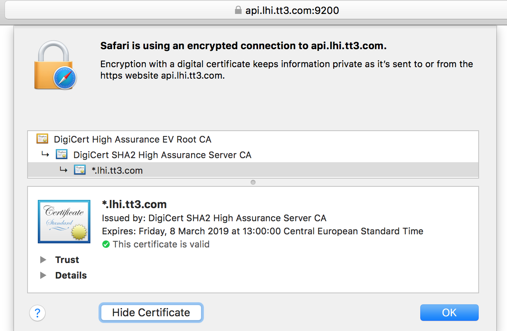

# Examples

## Querying data from the central logstash stack

Before running any query against the logstash Elasticsearch instance one has to create a certificate bundle for ****REMOVED****. Download all of the
certificates via your browser



and convert the certificates from *CER* to *PEM* format. This can be achieved with the following command:

```bash
openssl x509 -inform der -in DigiCert\ High\ Assurance\ EV\ Root\ CA.cer -out CA_root.pem
openssl x509 -inform der -in DigiCert\ SHA2\ High\ Assurance\ Server\ CA.cer -out CA_intermediate.pem
openssl x509 -inform der -in \*.***REMOVED***.cer -out ***REMOVED***
```

After that create a bundle of all these certificates and store it as ****REMOVED****:

```bash
cat CA_root.pem CA_intermediate.pem ***REMOVED*** > ***REMOVED***
```

Now you can run the query example with the following command:

```bash
python elastic/examples/query.py --host ***REMOVED*** --user $USER --index "navpipeline*" --cacert ***REMOVED***
```
